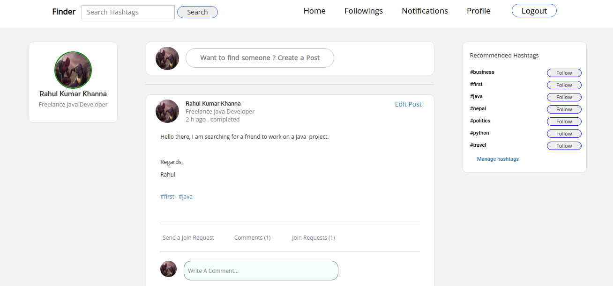

# Finder

Finder is a web based social networking application which provides a
platform for people to find like-minded individuals to pursue goals
together. Finder connects a user with certain interests to other users
with similar interests.

The users register themselves on Finder. They create a post where they
specify the business they are finding friends for. They assign hashtags
to the post.

The other users, who have followed the same hashtags, on the Finder
view the post. If they are interested to carry the business together, they
send the Join Request to the post. The author of the post views the join
requests and make a selection. The author, then, marks the post as
completed.

The technology stack used to built Finder is : HTML, CSS, Bootstrap,
JavaScript, <strong>Java</strong>, <strong>Spring Boot</strong>, MySQL.

 

# Demo

 

